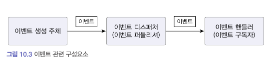

# 이벤트

- 이벤트는 과거에 벌어진 어떤 것을 의미한다.
  - 예를 들어 사용자가 암호를 변경한 것을 '암호를 변경했음 이벤트'가 벌어졌다고 할 수 있다. 그리고 이벤트가 발생한다는 것은 상태가 변경됐다는 것을 의미한다.
- 이벤트는 발생하는 것에서 끝나지 않고, 이벤트가 발생하면 그 이벤트에 반응하여 원하는 동작을 수행하는 기능을 구현한다.

```javascript
$("#myBtn").click(function (evt) {
  alert("경고");
});
```

위 코드는 자바스크립트 JQuery를 이용해서 작성한 코드이다. 이 코드에 click()에 전달한 함수는 'myBtn' 버튼에서 'Click' 이벤트가 발생하면 그 이벤트에 반응하여 함수를 실행한다.

도메인 모델에서도 위와 비슷하게 도메인의 상태 변경을 이벤트로 표현할 수 있다.

### **이벤트 관련 구성요소**

도메인 모델에이벤트를 도입하려면 네 개의 구성요소를 구현한다.

- 이벤트
- 이벤트 생성 주체
  - 도메인 모델에서 이벤트 생성 주체는 엔티티, 밸류, 도메인 서비스와 같은 도메인 객체이다.
  - 도메인 객체는 도메인 로직을 실행해서 상태가 바뀌면 관련 이벤트를 발생시킨다.
- 이벤트 디스패처(퍼블리셔)
  - 이벤트 생성 주체와 이벤트 핸들러를 연결해 준다.
  - 이벤트 생성 주체는 이벤트를 생성해서 디스패처에 이벤트를 전달한다.
  - 이벤트를 전달받은 디스패처는 해당 이벤트를 처리할 수 있는 핸들러에 이벤트를 전파한다.
  - 이벤트 디스패처의 구현 방식에 따라 이벤트 생성과 처리르 동기나 비동기로 실행하게 된다.
- 이벤트 핸들러(구독자)
  - 이벤트 생성 주체가 발생한 이벤트에 반응한다.
  - 이벤트 핸들러는 생성 주체가 발생한 이벤트를 전달받아 이벤트에 담긴 데이터를 이용해서 원하는 기능을 실행한다.



### **이벤트의 구성**

- 이벤트 종류: 클래스 이름으로 이벤트 종류를 표현
- 이벤트 발생 시간
- 추가 데이터: 이벤트와 관련된 정보

이벤트는 이벤트 핸들러가 작업을 수행하는 데 필요한 데이터를 담아야 한다. 데이터가 부족하면 핸들러는 필요한 데이터를 읽기 위해 관련 API를 호출하거나 DB에서 데이터를 직접 읽어와야 하기 때문이다.

### **이벤트 용도**

1.트리거

- 도메인의 상태가 바뀔 때 다른 후처리가 필요하면 후처리를 실행하기 위한 트리거로 이벤트를 사용한다.

2. 서로 다른 시스템 간의 데이터 동기화

### **이벤트 장점**

1. 서로 다른 도메인 로직이 섞이는 것을 방지할 수 있다.
2. 기능 확장이 용이하다.

### **이벤트, 핸들러, 디스패처 구현**

- 이벤트 클래스: 이벤트를 표현한다.
- 디스패처: 스프링이 제공하는 ApplicationEventPublisher를 이용한다.
- Events: 이벤트를 발행한다. 이벤트 발행을 위해 ApplicationEventPublisher를 사용한다.
- 이벤트 핸들러: 이벤트를 수신해서 처리한다. 스프링이 제공하는 기능을 사용한다.

> 이번 장은 특정 기능에 덧대어 설명하는 부분이 많다. java에 스프링에 대해서 모르기 때문에 추후에 Java와 스프링을 배우게 된다면 다시 정리할 것.
