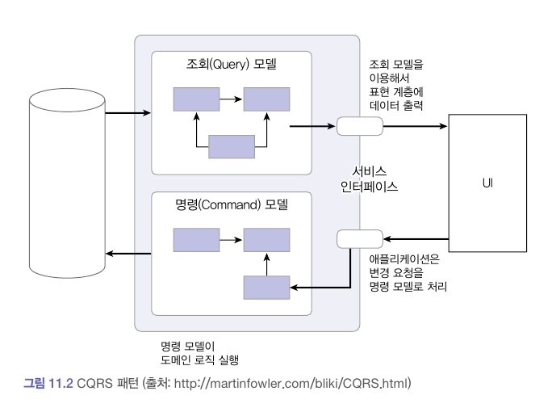

# CQRS

### 단일모델의 단점

시스템 상태를 변경할 때와 조회할 때 단일 도메인 모델을 사용한다.
하나의 서비스를 제공하려면 서비스에 묶인 여러 애그리거트에서 데이터를 가져와야 할 수도 있다. 하지만 여러 애그리거트에서 데이터를 가져오는 것은 구현하기에는 고려할 게 많아서 구현을 복잡하게 만드는 원인이 된다.

### **CQRS (Command Query Responsibility Segregation)**

(CQRS 아는 척 하기)[https://www.youtube.com/watch?v=xf0kXMTFJm8]

시스템이 제공하는 기능은 크게 상태를 변경하는 기능, 상태 정보를 조회하는 기능으로 나뉜다.

도메인 모델 관점에서 상태 변경은 주로 한 애그리거트의 상태를 변경한다.
반면에 조회 기능에 필요한 데이터를 표기하려면 두 개 이상의 애그리거트가 필요할 때가 많다.

상태를 변경하는 범위와 상태를 조회하는 범위가 정확하게 일치하지 않기 때문에 단일 모델로 두 종류의 기능을 구현하면 모델이 불필요하게 복잡해진다. 이 복잡도를 해결하기 위해 사용하는 방법이 바로 **CQRS**이다.

> 명령(시스템 데이터 변경) 역할을 수행하는 구성요소와  
> 쿼리(시스템 데이터 조회) 역할을 수행하는 구성 요소를  
> 나누는 것이 **CQRS**

- C: Command **명령**
  - 시스템 데이터 변경
  - 기능 예: 주문 취소, 배송 완료
- Q: Query **쿼리**
  - 시스템 데이터 조회
  - 기능 예: 주문 목록
- R: Responsibilty **책임**
  - 구성 요소의 역할
  - 구성 요소 (모델)
    - 클래스, 함수
    - 모듈/패키지
    - 웹서버/DB
- S: Segregation **분리**
  - 역할에 따라 구성 요소 나누기

CQRS는 복잡한 도메인에 적합하고, 각 모델에 맞는 구현 기술을 선택할 수 있다.
도메인이 복잡할수록 명령 기능과 조회 기능이 다루는 데이터 범위에 차이가 난다. 이 두 기능을 단일 모델로 처리하면 조회 기능의 로딩 속도를 위해 모델 구현이 필요 일상으로 복잡해진다.

### CQRS 장단점

**장점**

- 명령 모델을 구현할 때 도메인 자체에 집중할 수 있다.

  - 복잡한 도메인은 주로 상태 변경 로직이 복잡한데 명령 모델과 조회 모델을 구분하면 조회 성능을 위한 코드가 명령 모델에 없으므로 도메인 로직을 구현하는 데 집중할 수 있다. (복잡도 👇)

- 조회 성능을 향상시키는 데 유리하다.
  - 조회 단위로 캐시 기술을 적용할 수 있다
  - 조회에 특화된 쿼리를 마음대로 사용할 수도 있다.
  - 조회 전용 모델을 사용하기 때문에 조회 성능을 높이기 위한 코드가 명령 모델에 영향을 주지 않는다.

**단점**

- 구현해야 할 코드가 더 많다는 점이다.
  - 명령 모델과 조회 모델을 다른 구현 기술을 사용해서 구현하기도 하고 경우에 따라 다른 저장소를 사용하기도 한다.

**결론**

- 장단점을 고려해서 CQRS 패턴을 도입할지 여부를 결정해야한다.
  - 도메인이 복잡하지 않은데 CQRS를 도입하면 두 모델을 유지하는 비용만 높아지고 얻을 수 있는 이점은 없다.
  - 반면에 트래픽이 높은 서비스인데 단일 모델을 고집하면 유지 보수 비용이 오히려 높아질 수 있으므로 CQRS 도입을 고려해야 한다.
