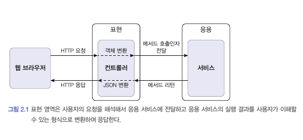
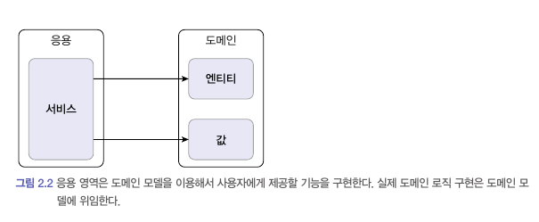
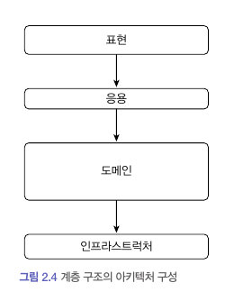
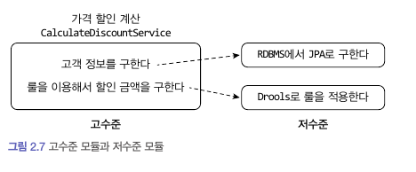
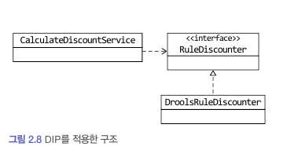
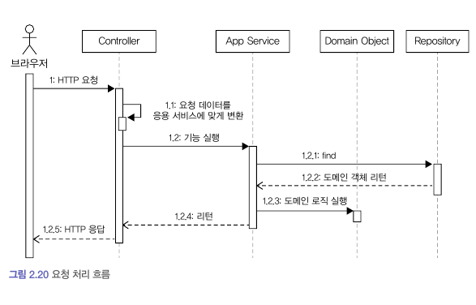

## 네 개의 영역

---

### 표현 영역(UI 영역)

- 사용자의 요청을 받아 응용 영역에 전달함

  - 이때 요청을 응용 영역 서비스가 요구하는 형식의 객체 타입으로 변환 후 전달함

- 응용 영역의 처리 결과를 다시 사용자에게 보여줌

- 이때 표현 영역의 사용자는 사람 또는 외부 시스템일 수도 있음



---

### 응용 영역

- 표현 영역을 통해 사용자의 요청을 전달받음

- 응용 영역은 **사용자에게 제공해야 할 기능**을 구현함

  - '주문 등록', '주문 취소', '상품 상세 조회'와 같은 기능을 구현함
  - 기능을 구현하기 위해 도메인 모델을 사용함
  - 응용 영역은 로직을 직접 수행하기 보다는 도메인 모델에 로직 수행을 위임함



```ts
class CancelOrderService {
  public cancelOrder(orderId: string) {
    const order: Order = findOrderById(orderId);
    if (order === null) throw new OrderNotFoundException(orderId);
    order.cancle();
  }
}
```

---

### 도메인 영역

- 도메인의 핵심 로직을 구현함
  - 예를 들어 주문 도메인에서 '배송지 변경', '결제 완료', '주문 총액 계산'과 같은 핵심 로직을 구현함

> 🤔 응용 영역의 기능과 도메인 영역의 기능이 비슷해보이는데?
>
> - 응용 영역의 기능과 도메인 영역의 기능은 성격이 다름
>
>   - **실제 사용자가 원하는 기능**을 제공하는 코드를 응용 영역에 구현함
>   - 시스템이 제공할 **도메인 규칙**을 구현한 코드를 도메인 영역에 구현함

---

### 인프라스트럭쳐 영역

- 논리적인 개념을 표현하기 보다 실제 구현을 다룸
  - RDBMS 연동 처리
  - 메시징 큐에 메시지를 전송, 수신
  - 몽고DB나 레디스와의 데이터 연동을 처리
  - SMTP를 이용한 메일 발송 기능
  - 등 ...


도메인, 응용, 표현 영역은 구현 기술을 사용한 코드를 직접 만들지 않습니다.  
대신 인프라스트럭처 영역에서 제공하는 기능을 사용해서 필요한 기능을 개발합니다.

---

## 계층 구조 아키텍처



- 계층 구조

  - 상위 계층에서 하위 계층을 의존함

  - 반대로 하위 계층은 상위 계층을 의존해선 안됨

  - 편리함을 위해 상위 계층이 하위 계층의 더 아래 계층에 의존하기도 함
    - 직관적으로 이해하기 쉬움
    - 예) 응용 계층이 도메인 계층을 건너 인프라스트럭처 계층에 의존

하지만 이런 계층 구조는 표현, 응용, 도메인 계층이 상세한 구현 기술을 다루는 인프라스트럭처 계층에 종속된다.  
인프라스트럭처에 의존하면 '테스트 어려움'과 '기능 확장의 어려움'이라는 두 가지 문제가 발생한다.

해답은 **DIP(Dependency Inversion Principle)**.

---

## DIP (Dependency Inversion Principle)

### 가격 할인 계산 서비스

가격 할인 계산을 하려면?

- 고객 정보를 구함
- 고객 정보와 주문 정보를 이용해 할인을 적용하는 룰을 실행



- CalculateDiscountService
  - 고수준 모듈로 의미 있는 단일 기능을 제공함
  - 저수준 모듈을 사용해 가격 할인 계산 기능을 구현함(의존)
    - 고객 정보를 읽어오는 모듈(저수준)
    - 룰을 실행하는 모듈(저수준)
  - 이는 테스트와 구현 변경을 어렵게 함
    - DIP를 적용해 저수준 모듈이 고수준 모듈에 의존하도록 바꿔야 함

---

### 가격 할인 계산 서비스에 DIP를 적용한 구조



- CalculateDiscountService

  - 더 이상 저수준 모듈에 직접적으로 의존하지 않음
  - 룰을 이용한 할인 금액 계산을 추상화한 인터페이스를 의존할 뿐

- RuleDiscounter 인터페이스

  - 룰을 이용한 할인 금액 계산은 고수준 모듈의 개념이므로 인터페이스는 고수준 모듈에 속함

- DroolsRuleDiscounter
  - 고수준의 하위 기능인 RuleDiscounter를 구현한 것이므로 저수준 모듈에 속함

### DIP를 적용함으로써 얻는 이점

- 고수준 모듈은 더 이상 저수준 모듈 의존하지 않음
  - 실제 사용할 저수준 구현 객체는 컨테이너에 의해 주입됨
  - 저수준 모듈이 변경되어도 고수준 모듈을 수정할 필요가 없음
- 대역 객체를 사용해 테스트를 진행할 수 있음

---

## 도메인 영역의 주요 구성요소

### 엔티티

- 고유의 식별자를 갖는 객체로 자신의 라이프 사이클을 갖는다.
- 주문<sup>Order</sup>, 회원<sup>Member</sup>, 상품<sup>Product</sup>과 같이 도메인의 고유한 개념을 표현한다.
- 도메인 모델의 데이터를 포함하며 해당 데이터와 관련된 기능을 함께 제공한다.

> 도메인 모델 엔티티와 DB관계형 모델의 엔티티는 다르다.
>
> 1. 도메인 모델의 엔티티는 데이터와 함께 도메인 기능을 함께 제공한다.
>    - 예를들어 주문을 표현하는 엔티티는 주문과 관련된 데이터 뿐만 아니라 주소 변경을 위한 기능을 함께 제공함.
> 2. 도메인 모델의 엔티티는 두 개 이상의 데이터가 개념적으로 하나인 경우 밸류 타입을 이용해 표현할 수 있다.
>    - DB 관계형 모델은 밸류 타입을 표현하기 힘듦
>    - 별도의 테이블로 분리해서 저장해야 함

### 벨류

- 고유의 식별자를 갖지 않는 객체로 주로 개념적으로 하나인 값을 표현할 때 사용된다.
- 배송지 주소를 표현하기 위한 주소<sup>Address</sup>나 구매 금액을 위한 금액<sup>Money</sup>과 같은 타입이 밸류 타입이다.
- 엔티티의 속성으로 사용할 뿐만 아니라 다른 밸류 타입의 속성으로도 사용할 수 있다.

### 애그리거트

- 애그리거트는 연관된 엔티티와 밸류 객체를 개념적으로 하나로 묶은 것이다.
  - 관련된 객체를 애그리거트로 묶으면 복잡한 도메인을 상위 수준에서 이해하는데 도움이 된다.
- 예를 들어 주문과 관련된 Order엔티티, OrderLine 밸류, Orderer 밸류 객체를 '주문' 애그리거트로 묶을 수 있다.
- 애그리거트는 군집에 속한 객체를 관리하는 루트 엔티티를 갖는다.
  - 루트 엔티티를 이용해 애그리거트가 구현해야 할 기능을 제공한다.
  - 애그리거트를 사용하는 코드는 애그리거트 루트가 제공하는 기능을 실행하고 루트를 통해서 간접적으로 애그리거트 내의 다른 엔티티나 밸류 객체에 접근한다.
  - 이는 애그리거트의 내부 구현을 숨겨서 애그리거트 단위로 구현을 캡슐화할 수 있도록 돕는다.

### 리포지터리

도메인 객체를 지속적으로 사용하려면 RDBMS, NoSQL, 로컬 파일과 같은 물리적인 저장소에 도메인 객체를 보관해야 한다.  
이를 위한 도메인 모델이 리포지터리다.

- 도메인 모델의 영속성을 처리한다.
  - 애그리거트 단위로 도메인 객체를 저장하고 조회하는 기능을 정의한다.

### 도메인 서비스

- 특정 엔티티에 속하지 않은 도메인 로직을 제공한다.
- '할인 금액 계산'은 상품, 쿠폰, 회원 등급, 구매 금액 등 다양한 조건을 이용해서 구현하게 되는데, 이렇게 도메인 로직이 여러 엔티티와 밸류를 필요로 하면 도메인 서비스에서 로직을 구현한다.

---

## 요청 처리 흐름



### 표현 영역 - Controller

- 사용자가 전송한 데이터 형식이 올바른지 검사
- 응용 서비스가 요구하는 형식으로 데이터 변환
- 응용 서비스에 기능 실행 위임

### 응용 서비스 - AppService

- 도메인 모델을 이용해서 기능을 구현함
  - 두 개 이상의 도메인 객체를 사용하기도함
