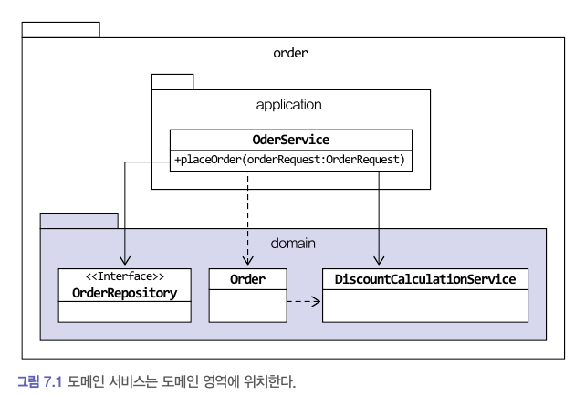

# 도메인 서비스

## 여러 애그리거트가 필요한 기능

도메인 영역의 코드를 작성하다 보면, 한 애그리거트로 기능을 구현할 수 없을 때가 있다. 대표적인 예가 결제 금액 계산 로직이다.

- 상품 애그리거트
  - 구매하는 상품의 가격이 필요하다.
  - 상품에 따라 배송비가 추가되기도한다.(상품의 무게에 따라 배송비가 추가될 경우를 말하는 듯하다.)
- 주문 애그리거트
  - 상품별로 구매 개수가 필요하다.
- 할인 쿠폰 애그리거트
  - 쿠폰별로 지정한 할인 금액이나 비율에 따라 주문 총 금액을 할인한다.
  - 할인 쿠폰을 조건에 따라 중복 사용할 수 있다거나 지정한 카테고리의 상품에만 적용할 수 있다는 제약 조건이 있다면 할인 계산이 복잡해진다.
- 회원 애그리거트: 회원 등급에 따라 추가 할인이 가능하다.

> _이 상황에서 실제 결제 금액을 계산해야 하는 주체는 어떤 애그리거트인가?_
>
> 한 애그리거트에 필요한 데이터를 모두 가지도록 한 뒤에 실제 결제 금액을 계산하도록 한다면, 한 애그리거트의 변경이 다른 애그리거트에 영향을 미칠 수 있다. 또한 이렇게 한 애그리거트에 도메인 기능을 억지로 구현하는 것은 자신의 책임 범위를 넘어서 기능을 구현하기 때문에 코드가 길어지고 외부에 대한 의존이 높아지며, 코드를 복잡하게 만들어 수정을 어렵게 만드는 요인이 된다.

이런 문제를 해소하는 가장 쉬운 방법은 도메인 기능을 별도 서비스로 구현하는 것이다.

---

## 도메인 서비스

도메인 서비스는 도메인 영역에 위치한 도메인 로직을 표현할 때 사용한다.

- 계산 로직: 여러 애그리거트가 필요한 계산 로직이나, 한 애그리거트에 넣기에는 다소 복잡한 계산 로직
- 외부 시스템 연동이 필요한 도메인 로직: 구현하기 위해 타 시스템을 사용해야 하는 도메인 로직

### **계산 로직과 도메인 서비스**

할인 금액 규칙 계산처럼 한 애그리거트에 넣기 애매한 도메인 개념을 구현하려면 도메인 서비스를 이용해서 도메인 개념을 명시적으로 드러내면 된다. 응용 영역의 서비스가 응용 로직을 다룬다면 도메인 서비스는 도메인 로직을 다룬다.

- 도메인 서비스
  - 상태 없이 로직만 구현한다. 도메인 서비스를 구현하는 데 필요한 상태는 다른 방법으로 전달 받는다.
  - 도메인 서비스를 사용하는 주체는 애그리거트가 될 수도 있고 응용 서비스가 될 수도 있다.
    - 애그리거트에 도메인 서비스를 전달하는 것은 응용 서비스 책임이다.
    - 애그리거트 기능을 실행할 때 도메인 서비스를 인자로 전달하지 않고 반대로 도메인 서비스의 기능을 실행할 때 애그리거트를 전달하기도 한다.
  - 도메인 서비스 객체를 애그리거트에 주입하지 않는다.
    - 애그리거트는 데이터와 메서드를 이용해 개념적으로 하나인 모델을 표현한다. 모델의 데이터를 담는 필드는 모델에서 중요한 구성요소이다. 그런데 도메인 서비스는 데이터 자체와는 관련이 없고 저장 대상도 아니다. 또 애그리거트가 제공하는 모든 기능에서 도메인 서비스를 필요로 하는 것도 아니기 때문이다.

> _특정 기능이 응용 서비스인지 도메인 서비스인지 구분하는 방법_  
> 해당 로직이 애그리거트의 상태를 변경하거나 애그리거트의 상태 값을 계산하는지 검사해본다.

### **외부 시스템 연동과 도메인 서비스**

외부 시스템이나 타 도메인과의 연동 기능도 도메인 서비스가 될 수 있다. 예를 들어 설문 조사 시스템과 사용자 역할 관리 시스템이 분리되어 있다고 하자. 설문 조사 시스템은 설문 조사를 생성할 때 사용자가 생성 권한을 가진 역할 인지 확인하기 위해 역할 관리 시스템과 연동해야 한다.

시스템 간 연동은 HTTP API 호출로 이루어질 수 있지만 설문 조사 도메인 입장에서는 사용자가 설문 조사 생성 권한을 가졌는지 확인하는 도메인 로직으로 볼 수 있다.

### **도메인 서비스의 패키지 위치**

도메인 서비스는 도메인 로직을 표현하므로 도메인 서비스의 위치는 다른 도메인 구성요소와 동일한 패키지에 위치한다.

### **도메인 서비스의 인터페이스와 클래스**

도메인 서비스의 로직이 고정되어 있지 않은 경우 도메인 서비스 자체를 인터페이스로 구현하고 이를 구현한 클래스를 둘 수도 있다. 특히 도메인 로직을 외부 시스템이나 별도 엔진을 이용해서 구현할 때 인터페이스와 클래스를 분리하게 된다.
