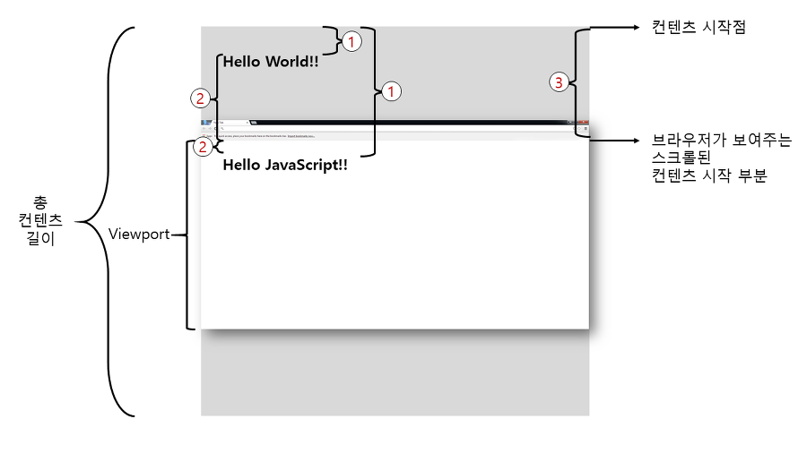

# 드래그앤드롭

> ### **절대위치**와 **상대위치**
>
> 절대위치는 *시작점*으로 부터 떨어진 크기의 값입니다.  
> 상대위치는 *어떤 기준*으로 부터 떨어진 크기의 값입니다.
>
> ### **시작점, 어떤 기준이 무엇인가?**
>
> 
>
> **절대위치**의 시작점은 그림에서 컨텐츠 시작점을 의미합니다.  
> 따라서 Hello World!!의 요소와 Hello JavaScript!!의 절대좌표(Y값)는 그림에서 1번의 길이를 나타냅니다.
>
> **상대위치**의 *어떤 기준*은 누굴 선택하느냐 문제입니다.  
> 만약 *어떤 기준*이 Viewport일 경우 두 요소의 상대좌표(Y)는 그림에서 2번의 길이를 나타냅니다.

---

### **마우스 이벤트 객체의 clientX, offsetX, pageX, screenX 차이**

#### clientX, clientY

클라이언트 영역 내의 가로, 세로 좌표를 제공합니다.  
브라우저 창을 통해 보이는 페이지의 왼쪽 상단을 기준으로 합니다.

#### pageX, pageY

랜더링된 전체 페이지의 왼쪽 상단 모서리를 기준으로 합니다.(스크롤로 가려진 부분까지 포함)

#### offserX, offsetY

이벤트 대상의 왼쪽 상단 모서리를 기준으로 합니다.

#### screenX, screenY

모니터 화면을 기준으로 좌표를 제공합니다.
